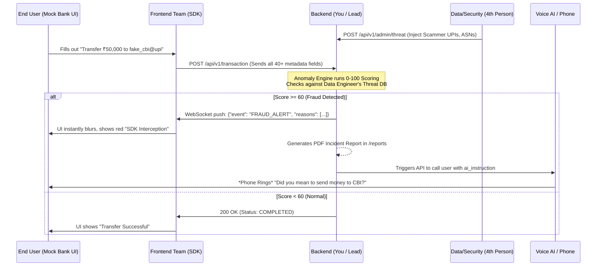

# Sentinel SDK - System Integration Architecture

To have a successful hackathon demo, all 4 team members must connect their components into a single, cohesive loop. Here is exactly how everything integrates.

## The Big Picture (Architecture Diagram)

## How to physically connect the team

Since you are at a hackathon, everyone is likely working on their own laptops. Here is how you connect them:

### 1. The Central Server (Your Laptop)
As the Backend Lead, your laptop is the central brain.
- You run `uvicorn main:app --host 0.0.0.0 --port 8000`.
- *(Using `0.0.0.0` allows other computers on the same Wi-Fi to connect to you).*
- Find your laptop's local IP address (e.g., `192.168.1.55`).

### 2. The Data Engineer (4th Person)
- From their laptop, they run scripts to push their ML datasets to you.
- Instead of targeting `127.0.0.1`, their Python scripts must target your IP: `http://192.168.1.55:8000/api/v1/admin/threat`.

### 3. The Frontend Team (UI / SDK)
- In their Javascript/React code, they must update their endpoints to point to your laptop.
- **REST API:** `fetch('http://192.168.1.55:8000/api/v1/transaction')`
- **WebSockets:** `new WebSocket('ws://192.168.1.55:8000/ws/alerts')`
- When they click "Send" on their Mock Bank UI, the data flows across the Wi-Fi into your backend.

### 4. The Voice AI integration (Cloud)
- If you use a service like Twilio or Bland AI, your backend simply makes an outbound HTTP request to their cloud servers when a transaction hits `Critical Risk`. The cloud server then physically dials the target cell phone. 

## The Hackathon Demo Workflow
1. **Setup**: The Data Engineer pushes their threats to your server.
2. **Action**: The judge watches the Frontend UI as someone attempts a scam transaction.
3. **Magic**: The data hits your backend, gets scored against the Threat DB, fires the WebSocket back to the Frontend (blocking the screen), saves the PDF, and triggers the phone call.

It operates in a complete circle!
